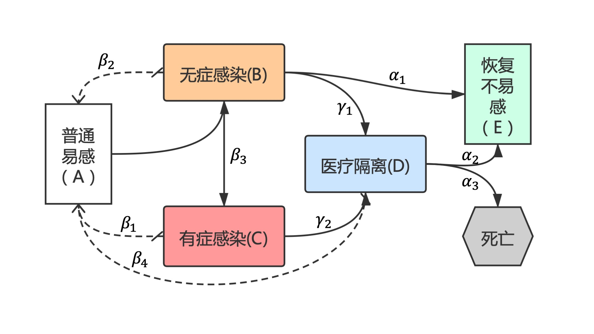
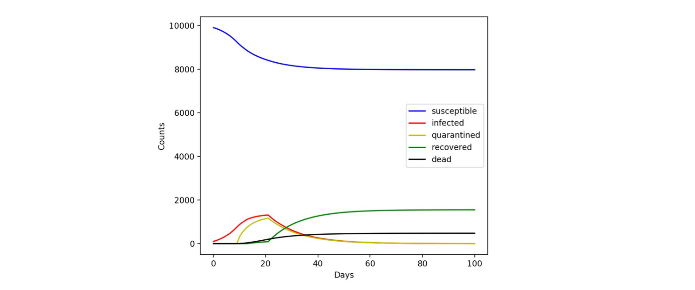
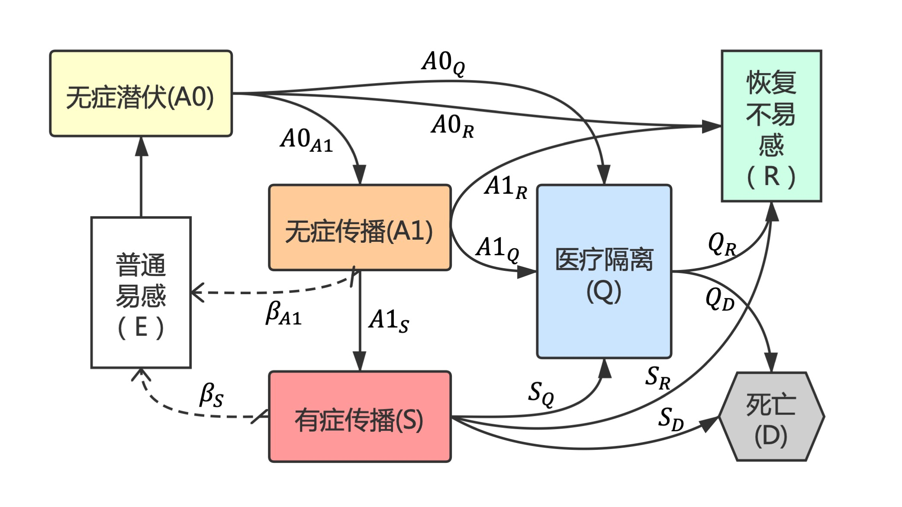

# nCov-model
Spreading simulation for coronavirus or other epidemics.
 
## 说明
整个项目分为两部分，第一部分为简单马尔可夫模型的推导，即 markov-naive.py 文件；第二部分为粒子状态的类蒙卡模拟，即particle\_simulation.py 和 particle\_simulation\_config.py。

#### 1. 简单马尔可夫模型
顾名思义，整个模型通过参数规定不同状态之间的转移率来实现演变，且每个状态只与其前面的一个或多个状态有关。该模型的架构比较简单，可做大概模拟。

**(1) 状态说明：**

* N ：所有状态的总人数
* A ：普通易感
* B ：无症状感染
* C ：有症状感染
* D ：医疗隔离
* E ：恢复/不易感
* F ：死亡

**(2) 参数说明：**

（主要参数如下图）

另外，考虑状态变化的时间分布，我们使用一个最简单的截断方法，即：

* 开始产生医疗隔离的时间：gamma\_start
* 无症感染开始产生自愈的时间：alpha\_1\_start
* 医疗隔离开始产生治愈的时间：alpha\_2\_start
* 医疗隔离开始产生死亡的时间：alpha\_3\_start
* 感染开始出现症状的时间：beta\_3\_start

**(3) 结果展示：**

结果显示出基本的指数上升与下降趋势。

#### 2. 粒子近似蒙特卡洛模拟
所谓“近似”，指的是在模拟中不考虑粒子的空间分布信息。主要影响是，正常易感人群被感染的过程依旧是马尔可夫过程。而对于其他状态之间的转化，不同粒子则有不同的表现，是蒙卡过程。

**(1) 状态说明**

* N ：所有状态总人数
* E ：正常易感
* A0 ：无症潜伏
* A1 ：无症传播
* S ：发病传播
* Q ：确诊隔离/医疗介入
* R ：恢复/不易感
* D ：死亡

**(2) 参数说明**

（主要参数如下图）

考虑到疾病的传播对公共区域人群密度的影响，模型设置人群密度变化量“PD”，该量为一个 [0~1] 之间的浮点数，作用在beta\_A1和beta\_S上。在SEIR模型中，人群密度项表示为“E/N”，在实际情况中，该值十分接近1（例如武汉一千万人，感染八万人，E/N>0.99），不能正确描述公共区域人群密度的变化。故在本模型中，PD值采用tanh或sigmoid函数描述，与感染人数百分比和死亡率呈负相关。

另外，状态间转移的时间分布全部使用高斯分布拟合，可以指定分布的“平均时间”（mu）和“标准差”（sigma）。例如从A1到S的发生时间满足均值为“mu\_A1\_to\_S”、标准差为“sg\_A1\_to\_S”的高斯分布。不同个体即为分布的采样。

**(3) 结果展示**

根据多次实验的结果，我们得到的结论是，对疫情防控起到至关重要的行为是**降低公共区域人群密度**，也即减少人与人之间的接触。尽管对发病群体的隔离也很重要，但在本模型中，如果不降低人群密度，仅仅隔离发病者，由于潜伏期的存在，最终结果依然是**全部感染**。